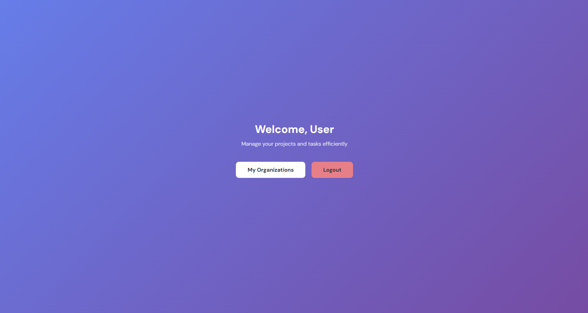
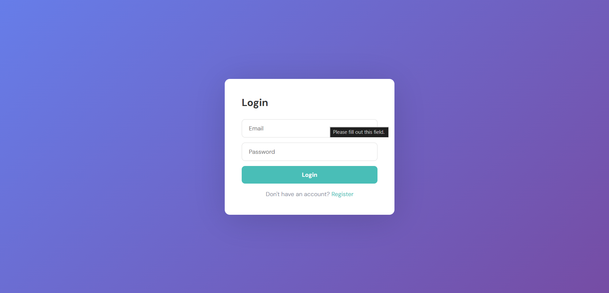
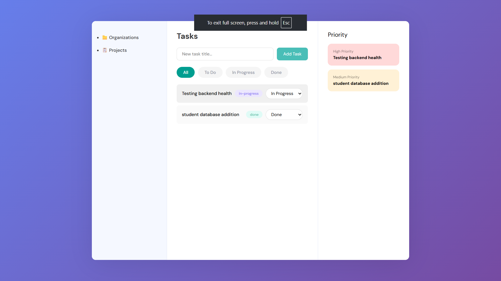
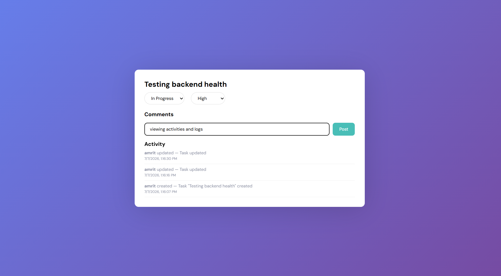

# 🚀 DevBoard — Project Management Tool

A full-stack MERN application for managing projects, organizations, and tasks with team collaboration, JWT authentication, activity tracking, and role-based access control.

<p align="center">
  
</p>

<p align="center">


</p>

---

# 📑 Table of Contents

- Features
- Live Demo
- Screenshots
- Architecture
- Database Schema
- Authentication Flow
- API Endpoints
- Tech Stack
- Project Structure
- Installation
- Environment Variables
- Security
- Future Improvements
- License

---

# ✨ Features

- 🔐 JWT Authentication & Authorization
- 👥 Multi-Organization Workspace
- 📁 Project Management
- ✅ Task Management
- 💬 Task Comments
- 📜 Activity Timeline
- 🔍 Task Filtering & Sorting
- 👤 Member Management
- 🛡 Protected Routes
- ⚡ RESTful APIs
- 📦 Modular MVC Architecture

---

# 🌐 Live Demo

Frontend

https://dev-board-dun.vercel.app

Backend

https://devboard-6lht.onrender.com

> **Note:** Backend is hosted on Render's free tier and may require approximately **30 seconds** to wake up.

---

# 📸 Screenshots

|            Login             |            Dashboard             |          Task Board          |
| :--------------------------: | :------------------------------: | :--------------------------: |
|  |  |  |

|        Organizations        |            Task Detail             |            Activity             |
| :-------------------------: | :--------------------------------: | :-----------------------------: |
|  |  |  |

---

# 🏗 Architecture

```text
                    React + Vite
                         │
                         │
                    Axios Client
                         │
               JWT Authorization Header
                         │
──────────────────────────────────────────
                 Express Server
──────────────────────────────────────────
        Routes → Controllers → Services
                         │
                    Middleware
     (JWT, Validation, Error Handling)
                         │
                     Mongoose ODM
                         │
                    MongoDB Atlas
```

---

# 🗄 Database Schema

```text
User
│
├── owns ─────────────► Organization
│                         │
│                         ├── contains ─────► Project
│                         │                      │
│                         │                      ├── has ──► Task
│                         │                      │             │
│                         │                      │             ├── Comment
│                         │                      │             └── Activity
│                         │
└── member of ◄───────────┘
```

## Design Decisions

| Decision                         | Reason                                |
| -------------------------------- | ------------------------------------- |
| Referenced Comments              | Prevents MongoDB document size issues |
| Activity Collection              | Immutable audit log                   |
| Compound Indexes                 | Faster task filtering                 |
| Password hidden (`select:false`) | Prevent accidental exposure           |
| bcrypt (12 rounds)               | Strong password hashing               |

---

# 🔐 Authentication Flow

```text
User Registers
      │
Password hashed using bcrypt
      │
Stored in MongoDB
      │
User Login
      │
JWT Generated
      │
Stored in LocalStorage
      │
Axios automatically attaches token
      │
Express Middleware verifies JWT
      │
Authorized Request
```

---

# 📡 REST API

## Authentication

| Method | Endpoint             |
| ------ | -------------------- |
| POST   | `/api/auth/register` |
| POST   | `/api/auth/login`    |
| GET    | `/api/me`            |

---

## Organizations

| Method | Endpoint        |
| ------ | --------------- |
| POST   | `/api/orgs`     |
| GET    | `/api/orgs`     |
| GET    | `/api/orgs/:id` |

---

## Projects

| Method | Endpoint                        |
| ------ | ------------------------------- |
| POST   | `/api/orgs/:orgId/projects`     |
| GET    | `/api/orgs/:orgId/projects`     |
| GET    | `/api/orgs/:orgId/projects/:id` |

---

## Tasks

| Method | Endpoint                         |
| ------ | -------------------------------- |
| POST   | `/api/projects/:projectId/tasks` |
| GET    | `/api/projects/:projectId/tasks` |
| GET    | `/api/tasks/:id`                 |
| PATCH  | `/api/tasks/:id`                 |
| DELETE | `/api/tasks/:id`                 |

---

## Comments

| Method | Endpoint                      |
| ------ | ----------------------------- |
| POST   | `/api/tasks/:taskId/comments` |
| GET    | `/api/tasks/:taskId/comments` |

---

## Activity

| Method | Endpoint                      |
| ------ | ----------------------------- |
| GET    | `/api/tasks/:taskId/activity` |

---

# 🛠 Tech Stack

## Frontend

- React
- Vite
- React Router
- Axios
- Context API

## Backend

- Node.js
- Express.js

## Database

- MongoDB Atlas
- Mongoose ODM

## Authentication

- JWT
- bcryptjs

## Security

- Helmet
- CORS

## Deployment

- Vercel
- Render
- MongoDB Atlas

---

# 📂 Project Structure

```text
DevBoard
│
├── client
│   ├── public
│   ├── src
│   │   ├── api
│   │   ├── components
│   │   ├── context
│   │   ├── hooks
│   │   ├── pages
│   │   ├── services
│   │   ├── utils
│   │   ├── App.jsx
│   │   └── main.jsx
│   └── package.json
│
├── server
│   ├── src
│   │   ├── config
│   │   ├── controllers
│   │   ├── middleware
│   │   ├── models
│   │   ├── routes
│   │   ├── services
│   │   ├── utils
│   │   └── index.js
│   ├── .env
│   └── package.json
│
└── README.md
```

---

# 🚀 Installation

## Clone Repository

```bash
git clone https://github.com/yourusername/devboard.git

cd devboard
```

---

## Backend

```bash
cd server

npm install

npm run dev
```

---

## Frontend

```bash
cd client

npm install

npm run dev
```

---

# 🔑 Environment Variables

Create a `.env` file inside `/server`

```env
PORT=5000

MONGODB_URI=mongodb://localhost:27017/devboard

JWT_SECRET=your_secret_key

JWT_EXPIRE=7d

NODE_ENV=development
```

---

# 🔒 Security

- Password hashing using bcrypt
- JWT Authentication
- Protected Routes
- CORS
- Helmet Security Headers
- Environment Variables
- Centralized Error Handling

---

# 🧪 Quick Test

Health Check

```bash
curl https://devboard-6lht.onrender.com/api/health
```

Register User

```bash
curl -X POST https://devboard-6lht.onrender.com/api/auth/register \
-H "Content-Type: application/json" \
-d '{"name":"Test","email":"test@test.com","password":"password123"}'
```

---

# 🎯 Future Improvements

- [ ] Email Invitations
- [ ] Drag & Drop Kanban
- [ ] Notifications
- [ ] WebSockets
- [ ] Calendar View
- [ ] File Attachments
- [ ] Team Roles & Permissions
- [ ] Dark Mode
- [ ] Docker Support

---

# 🤝 Contributing

Contributions are welcome.

1. Fork the repository

2. Create your feature branch

```bash
git checkout -b feature/new-feature
```

3. Commit your changes

```bash
git commit -m "Add new feature"
```

4. Push to your branch

```bash
git push origin feature/new-feature
```

5. Open a Pull Request.

---

# 📄 License

This project is licensed under the MIT License.

---

<p align="center">

Made with ❤️ by <b>Aakash Kumar</b>

</p>
